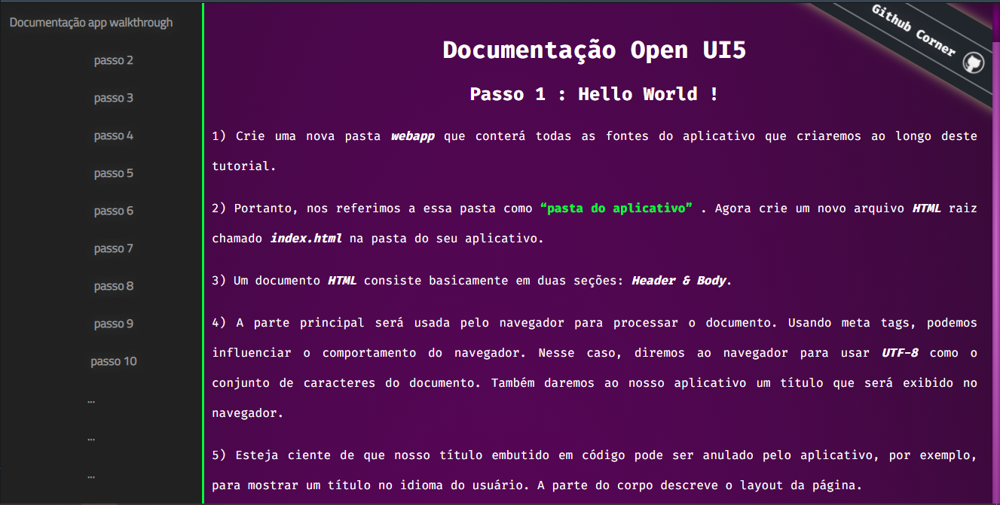

 
  
  &#xa0;
  

  <!-- <a href="https://doc.netlify.com">Demo</a> -->

<h1 align="center">Doc</h1>

  

  

  

  <!--  -->

  <!--  -->

  <!--  -->

<!-- Status -->

<!-- <h4 align="center"> 
	🚧  Doc 🚀 Em construção...  🚧
</h4> 

 -->

  <a href="#dart-sobre">Sobre</a> &#xa0; | &#xa0; 

  <a href="#memo-licença">Licença</a> &#xa0; | &#xa0;
  <a href="https://github.com/Gabriel4420" target="_blank">Autor</a>

 

## :dart: Sobre ##

Documentação não official do SAP OpenUI5 em

Feito com :heart: por <a href="https://github.com/Gabriel4420" target="_blank">Gabriel Rodrigues Perez</a>

&#xa0;

<a href="#top">Voltar para o topo</a>
